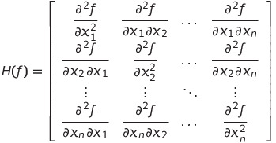

# TOML - First project
### Author: Oriol Martínez Acón
### Date: March 2022

<!-- ADD EQUATIONS -->

## Introduction
The idea of this project is to identify the convexity of the problems and how to solve them using the programming language Python.

To solve the exercises we need to use the packages as **scipy** and **cvxpy**. This packages provides the minimum functions to solve convex/concave problems.

All the code developed for each of the exercises can be found in the following GitHub repository: [link](https://github.com/oriolmartinezac/TOML-Labs/tree/main/project-1). 

Before trying to solve any problem first is necessary to analyze it. It is essential to know what are the variables, functions and constraints to verify if the problem we are trying to solve is either convex or concave.

Before entering in more detail with a problem is convex or not we first need to know what are **Hessian matrix**, **Gradient**, and **Jacobian matrix**.

The **Hessian matrix** (*H(f)*) is the matrix that contains the second derivatives (*f''*) of a function given,  The way to represent the Hessian matrix is the following one.

The **Gradient** ($\nabla f$) is the vector field whose values at a point $p$ is the vector whose components are the partial derivatives of *f* (*f'*).
<!--TODO: Equation -->

The **Jacobian matrix** is the matrix of all its first-order partial derivatives (*f'*).
<!--TODO: Equation -->
So we can say also that the Jacobian is equal to the Gradient of the function.
<!--TODO: Equation -->

Now that **Hessian matrix**, **Gradient** and **Jacobian matrix** is shown, we can continue by verifying if a problem is convex. 
The way to do it is by fulfilling some features/conditions that are shown below:

1. **Domain of the function**: The way to verify a domain is convex, is to check if any linear combination of two points inside the function could have a representative value in the existing set. <!-- TODO: Equation -->
2. **First-order condition**: <!--TODO: Equations --> 
3. **Second-order condition**: To fulfill the second-order condition, the Hessian matrix of the functions has to be positive semi-definite (<!-- TODO: $H \geq 0$-->). If this condition is fulfilled we can say the functions is convex. It is also important to remark that when the Hessian is equal to 0, it means that we have a flat plane (convex but not strictly convex).

So, one function will be convex if all the supporting hyper-planes are below the function given if it is the opposite is concave and if above/below could be convex and concave.
Is important to highlight that there are more ways to verify a function is convex, but the ones that are explaining more or are more easy to understand are those.
Another important concept is the **Lagrangian** of an optimization problem. The **Lagrangian** can be defined mathematically as for an optimization problem that is not necessary restricted as a convex problem:
<!-- TODO: Equation -->
The parameter <!-- TODO: Equation $\lambda_i$ --> refers to the Lagrange multiplier from the inequality constraints and the <!-- TODO: $\nu_i$ --> the Lagrange multiplier from the equality constraints.
The **Lagrange Dual Function** is defined as the minimum of the Lagrangian over <!--TODO: Equations $\lambda \in \mathbb{R}^m$ and $\nu \in \mathbb{R}^p$.-->
<!-- TODO: Equation -->
Since the <!-- TODO: Equation $q(\lambda,\nu)$ --> is an **infimum** of a family of affine functions, then it is a **concave** function. The **Lagrange Dual** function has lower bounds on optimal values <!-- TODO:($P^*$)-->.
For <!-- TODO: Equation $\lambda \geq 0$ and any $\nu -> q(\lambda) \leq p^*$.-->
The idea is to find the best **lower bound** that can be obtained with the Lagrange dual function.
<!-- TODO: Equation -->
Where <!-- TODO: Equation $d^*$ --> is the best solution of the Lagrange Dual Problem.
<!-- TODO: Equation -->
The weak duality theorem says that for the general problem, the optimal value of the Lagrange dual problem ( <!-- TODO: Equation $d^*$ -->) and the optimal value of the primal minimization problem ( <!-- TODO: Equation $p^*$ -->) are related by:
<!-- TODO: Equation -->
$$ d^* \le p^ $$