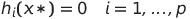

# TOML - First project
### Author: Oriol Martínez Acón
### Date: March 2022

<!-- ADD EQUATIONS -->

## Introduction
The idea of this project is to identify the convexity of the problems and how to solve them using the programming language Python.

To solve the exercises we need to use the packages as **scipy** and **cvxpy**. This packages provides the minimum functions to solve convex/concave problems.

All the code developed for each of the exercises can be found in the following GitHub repository: [link](https://github.com/oriolmartinezac/TOML-Labs/tree/main/project-1). 

Before trying to solve any problem first is necessary to analyze it. It is essential to know what are the variables, functions and constraints to verify if the problem we are trying to solve is either convex or concave.

Before entering in more detail with a problem is convex or not we first need to know what are **Hessian matrix**, **Gradient**, and **Jacobian matrix**.

The **Hessian matrix** (*H(f)*) is the matrix that contains the second derivatives (*f''*) of a function given,  The way to represent the Hessian matrix is the following one.

The **Gradient** ($\nabla f$) is the vector field whose values at a point $p$ is the vector whose components are the partial derivatives of *f* (*f'*).

The **Jacobian matrix** is the matrix of all its first-order partial derivatives (*f'*).

So we can say also that the Jacobian is equal to the Gradient of the function.

Now that **Hessian matrix**, **Gradient** and **Jacobian matrix** is shown, we can continue by verifying if a problem is convex. 
The way to do it is by fulfilling some features/conditions that are shown below:

1. **Domain of the function**: The way to verify a domain is convex, is to check if any linear combination of two points inside the function could have a representative value in the existing set. 

2. **First-order condition**:

for $x \in \mathbb{R}^n, b \in \mathbb{R}^m, A \in \mathbb{R}^{mxn}$.

3. **Second-order condition**: To fulfill the second-order condition, the Hessian matrix of the functions has to be positive semi-definite ($H \geq 0$). If this condition is fulfilled we can say the functions is convex. It is also important to remark that when the Hessian is equal to 0, it means that we have a flat plane (convex but not strictly convex).

So, one function will be convex if all the supporting hyper-planes are below the function given if it is the opposite is concave and if above/below could be convex and concave.
Is important to highlight that there are more ways to verify a function is convex, but the ones that are explaining more or are more easy to understand are those.
Another important concept is the **Lagrangian** of an optimization problem. 

The **Lagrangian** can be defined mathematically as for an optimization problem that is not necessary restricted as a convex problem:

The parameter $\lambda_i$ refers to the Lagrange multiplier from the inequality constraints and the $\nu_i$ the Lagrange multiplier from the equality constraints.
The **Lagrange Dual Function** is defined as the minimum of the Lagrangian over $\lambda \in \mathbb{R}^m$ and $\nu \in \mathbb{R}^p$.

Since the $q(\lambda,\nu)$ is an **infimum** of a family of affine functions, then it is a **concave** function. The **Lagrange Dual** function has lower bounds on optimal values ($P^\*$).
For $\lambda \geq 0$ and any $\nu -> q(\lambda) \leq p^*$.
The idea is to find the best **lower bound** that can be obtained with the Lagrange dual function.

Where $d^*$ is the best solution of the Lagrange Dual Problem.

The weak duality theorem says that for the general problem, the optimal value of the Lagrange dual problem ($d^\*$) and the optimal value of the primal minimization problem ($p^\*$) are related by:

This means that the dual problem provides the lower bound for the primal problem. The opposite holds true for a primal maximization problem. The difference between the two optimal values is called the optimal duality gap.
The strong duality theorem says that for convex problems that satisfy certain conditions, the optimal duality gap is zero, meaning that the optimal values of the primal and dual problems are the same. For convex problems to guarantee the strong duality condition, Slater's constraint qualifications must be met, i.e. the convex problem must be strictly feasible.
If $d^* \leq p^\*$, then there is **weak duality**, while if $d^* =  p^*$ there is **strong duality**.

The **Karush-Kuhn-Tucker** (KKT) conditions are first derivative tests (a.k.a. first-order necessary conditions) for a solution in non-linear programming to be optimal, provided that some regularity conditions are satisfied.
If we assume that $x^\*$ is the optimal point of the primal problem and ($\lambda^*, \nu^*$) the optimal points of the dual problem. The conditions are the following ones:
1. **Primal constraints:**

2. **Primal constraints:**

3. **Dual constraints:**

4. **Complementary slackness:**

5. **Gradient of Lagrangian vanishes:**

## Exercise 1
Given the following **objective function**:

With the following **constraints** and values for the variables:

And the values for the variables as:

### Identify whether is convex or not.

With the definitions explained before we can say that the domain of the problem is convex, as the variables in the set are real, i.e. all the linear combinations between the two points in the existing set (the representation of the function line).
Once the domain is checked, we have to analyze the objective function to see if it is whether convex or not. The easy way to check is by checking the **second-order condition**. The Hessian matrix is:

Now once the Hessian matrix is calculated we have to calculate the determinant of the Hessian matrix to know if it is positive semi-definite.

As the determinant of the Hessian matrix is less than 0 we can say that the Hessian is not positive semi-definite and then the objective function to minimize is not convex.
Summarizing we can say that the problem is not convex due to that the objective function is not convex.

### Find the minimum, e.g. use scipy.optimize.minimize (SLSQP as method) of python. Use as initial points x0 \[0,0], \[10,20], \[-10,1], \[-30,-30] and explain the difference in the solutions if any. Choose which ones give an optimal point/value and give how long take to converge to a result. Plot the objective curve and see whether the plot helps you to understand the optimization problem an results.

The program used could solve all the problems, i.e. find the points that minimizes the objective function, with the different initial guesses.

Solarized dark             |  Solarized Ocean
:-------------------------:|:-------------------------:
  |  

*Output of the program with initial guess as \[0,0].*

