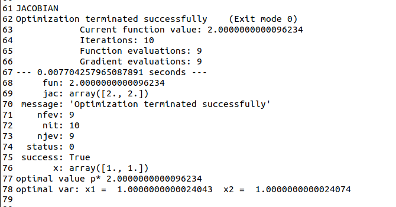

# TOML - First project
### Author: Oriol Martínez Acón
### Date: March 2022

<!-- ADD EQUATIONS -->

## Introduction
The idea of this project is to identify the convexity of the problems and how to solve them using the programming language Python.

To solve the exercises we need to use the packages as **scipy** and **cvxpy**. This packages provides the minimum functions to solve convex/concave problems.

All the code developed for each of the exercises can be found in the following GitHub repository: [link](https://github.com/oriolmartinezac/TOML-Labs/tree/main/project-1). 

Before trying to solve any problem first is necessary to analyze it. It is essential to know what are the variables, functions and constraints to verify if the problem we are trying to solve is either convex or concave.

Before entering in more detail with a problem is convex or not we first need to know what are **Hessian matrix**, **Gradient**, and **Jacobian matrix**.

The **Hessian matrix** (*H(f)*) is the matrix that contains the second derivatives (*f''*) of a function given,  The way to represent the Hessian matrix is the following one.

The **Gradient** ($\nabla f$) is the vector field whose values at a point $p$ is the vector whose components are the partial derivatives of *f* (*f'*).

The **Jacobian matrix** is the matrix of all its first-order partial derivatives (*f'*).

So we can say also that the Jacobian is equal to the Gradient of the function.

Now that **Hessian matrix**, **Gradient** and **Jacobian matrix** is shown, we can continue by verifying if a problem is convex. 
The way to do it is by fulfilling some features/conditions that are shown below:

1. **Domain of the function**: The way to verify a domain is convex, is to check if any linear combination of two points inside the function could have a representative value in the existing set. 

2. **First-order condition**:

for $x \in \mathbb{R}^n, b \in \mathbb{R}^m, A \in \mathbb{R}^{mxn}$.

3. **Second-order condition**: To fulfill the second-order condition, the Hessian matrix of the functions has to be positive semi-definite ($H \geq 0$). If this condition is fulfilled we can say the functions is convex. It is also important to remark that when the Hessian is equal to 0, it means that we have a flat plane (convex but not strictly convex).

So, one function will be convex if all the supporting hyper-planes are below the function given if it is the opposite is concave and if above/below could be convex and concave.
Is important to highlight that there are more ways to verify a function is convex, but the ones that are explaining more or are more easy to understand are those.
Another important concept is the **Lagrangian** of an optimization problem. 

The **Lagrangian** can be defined mathematically as for an optimization problem that is not necessary restricted as a convex problem:

The parameter $\lambda_i$ refers to the Lagrange multiplier from the inequality constraints and the $\nu_i$ the Lagrange multiplier from the equality constraints.
The **Lagrange Dual Function** is defined as the minimum of the Lagrangian over $\lambda \in \mathbb{R}^m$ and $\nu \in \mathbb{R}^p$.

Since the $q(\lambda,\nu)$ is an **infimum** of a family of affine functions, then it is a **concave** function. The **Lagrange Dual** function has lower bounds on optimal values ($P^\*$).
For $\lambda \geq 0$ and any $\nu -> q(\lambda) \leq p^*$.
The idea is to find the best **lower bound** that can be obtained with the Lagrange dual function.

Where $d^*$ is the best solution of the Lagrange Dual Problem.

The weak duality theorem says that for the general problem, the optimal value of the Lagrange dual problem ($d^\*$) and the optimal value of the primal minimization problem ($p^\*$) are related by:

This means that the dual problem provides the lower bound for the primal problem. The opposite holds true for a primal maximization problem. The difference between the two optimal values is called the optimal duality gap.
The strong duality theorem says that for convex problems that satisfy certain conditions, the optimal duality gap is zero, meaning that the optimal values of the primal and dual problems are the same. For convex problems to guarantee the strong duality condition, Slater's constraint qualifications must be met, i.e. the convex problem must be strictly feasible.
If $d^* \leq p^\*$, then there is **weak duality**, while if $d^* =  p^*$ there is **strong duality**.

The **Karush-Kuhn-Tucker** (KKT) conditions are first derivative tests (a.k.a. first-order necessary conditions) for a solution in non-linear programming to be optimal, provided that some regularity conditions are satisfied.
If we assume that $x^\*$ is the optimal point of the primal problem and ($\lambda^*, \nu^*$) the optimal points of the dual problem. The conditions are the following ones:
1. **Primal constraints:**

2. **Primal constraints:**

3. **Dual constraints:**

4. **Complementary slackness:**

5. **Gradient of Lagrangian vanishes:**

## Exercise 1
Given the following **objective function**:

With the following **constraints** and values for the variables:

And the values for the variables as:

### Identify whether is convex or not.

With the definitions explained before we can say that the domain of the problem is convex, as the variables in the set are real, i.e. all the linear combinations between the two points in the existing set (the representation of the function line).
Once the domain is checked, we have to analyze the objective function to see if it is whether convex or not. The easy way to check is by checking the **second-order condition**. The Hessian matrix is:

Now once the Hessian matrix is calculated we have to calculate the determinant of the Hessian matrix to know if it is positive semi-definite.

As the determinant of the Hessian matrix is less than 0 we can say that the Hessian is not positive semi-definite and then the objective function to minimize is not convex.
Summarizing we can say that the problem is not convex due to that the objective function is not convex.

### Find the minimum, e.g. use scipy.optimize.minimize (SLSQP as method) of python. Use as initial points x0 \[0,0], \[10,20], \[-10,1], \[-30,-30] and explain the difference in the solutions if any. Choose which ones give an optimal point/value and give how long take to converge to a result. Plot the objective curve and see whether the plot helps you to understand the optimization problem an results.

The program used could solve all the problems, i.e. find the points that minimizes the objective function, with the different initial guesses.

*Figure 1: Output of the program with initial guess as \[0,0].* |  *Figure 2: Output of the program with initial guess as \[10,20].*
:-------------------------:|:-------------------------:
  |  

*Figure 3: Output of the program with initial guess as \[-10,1].* |  *Figure 4: Output of the program with initial guess as \[-30,-30].*
:-------------------------:|:-------------------------:
  |  

In the following table we can see all the results from the solver using different initial guesses for $x_1$ and $x_2$.
| Initial guess | **Optimal value** ($p^\*$) | **Optimal variable $x_1$** | **Optimal variable $x_2$** |
|---------------|--------------------------------|---------------------------------|---------------------------------|
| [0, 0]        | 0.02355                        | -9.5474                         | 1.0474                          |
| [10, 20]      | 0.02355                        | -9.5474                         | 1.0474                          |
| [-10, 1]      | 0.02355                        | -9.5474                         | 1.0474                          |
| [-30, -30]    | 0.7653                         | -4.0402                         | 2.4751                          |

*Table 1: Results of the solver with the different initial guesses.*

Finally, the best way to understand the problem and how it is solved is by looking the graphic representation, e.g. plots. Below there are the plots of the objective function and the optimal values (minimal values) found in the optimization problem. One plot is from the matplotlib package and the other from GeoGebra. I put GeoGebra plot in order to see better the representation of the graph.

*Figure 5: Matplotlib's plot of the objective function and optimal values.* |  *Figure 6: GeoGebra's plot of the objective function and optimal values.*
:-------------------------:|:-------------------------:
  |  

As we can see in the table and in the plot, the objective function is not convex because it has different local minimums, found by the solver given different initial guesses, and one global minimum. That confirms the affirming said before, the objective function to minimize is not convex because there is not a unique minimum, global minimum.

### Give as input the Jacobian (exact gradient) to the method, and repeat and check whether the method speeds up.

If we want to find the Jacobian matrix we need to make the gradient of the objective function, as the Jacobian matrix is the same as the Gradient of the function. The Jacobian matrix contains then, all the partial derivatives.

 

The outputs given by sending the Jacobian matrix to solver are shown below.

*Figure 7: Output of the program with initial guess as \[0,0].* |  *Figure 8: Output of the program with initial guess as \[10,20].*
:-------------------------:|:-------------------------:
  |  

*Figure 9: Output of the program with initial guess as \[-10,1].* |  *Figure 10: Output of the program with initial guess as \[-30,-30].*
:-------------------------:|:-------------------------:
  |  

In the following table there are the number of iterations, function evaluations and gradient evaluations as the output of the solver program by using the different initial guesses.

| **Initial guesses**          | **Normal** (Iterations, function evaluations, gradient evaluations) | **Jacobian** (Iterations, function evaluations, gradient evaluations) |
|------------------------------|---------------------------------------------------------------------|-----------------------------------------------------------------------|
| ${x_1 = 0}$, ${x_2 = 0}$     | 17, 54, 17                                                          | 17, 20, 17                                                            |
| ${x_1 = 10}$, ${x_2 = 20}$   | 32, 105, 32                                                         | 27, 39, 27                                                            |
| ${x_1 = -10}$, ${x_2 = 1}$   | 3, 10, 3                                                            | 3, 4, 3                                                               |
| ${x_1 = -30}$, ${x_2 = -30}$ | 10, 46, 10                                                          | 42, 88, 41                                                            |

We can see that the **function evaluations** decrease in all the different cases and the iterations in some cases as in $x_1 = 10, x_2 = 20$. However, is important to remark that in the last initial guess ($x_1 = -30, x_2 = -30$) the Jacobian is not giving good iterations and not even good results. So, summarizing, we can say that Jacobian matrix improve in the performance of the solver in finding the solution of the problem. That is because if we do not give the Jacobian, the solver needs to calculate how much it has to descend to find the minimum (calculating the gradient), but if we give to the solver the Jacobian we are facilitating the calculation of the descent.

## Exercise 2

Given the following **objective function**:

With the following **constraints**:

### Identify whether is convex or not.

To know if the problem to solve is convex or not we have to check for the **domain**. As we can see in the problem statement, $x_1$ and $x_2$ can take all the existing values ($\mathbb{R}$).
Now we have to check the **Hessian matrix** and see if it is positive semi-definite.

The last step is to check for the **determinant** of the Hessian matrix.

The determinant is bigger than 0, so we can say that the Hessian matrix is **positive semi-definite** and then, the objective function is convex.

### Propose an initial point that is not feasible and an initial point that is feasible and check what happens with SLSQP as method.

For this section two different initial guesses have been choosing. These are \[(10, -10), (10, 10)]. The first one is not in a feasible set of the function, i.e. it does not fulfill all the constraints, and the second one is in a feasible set. That means only the second initial guess finds a valid solution for the problem (minimize the objective function by specific constraints). 
For example, the first guess, $x_1 = 10$ and $x_2 = -10$, does not fulfill all the constraints and then is not in the feasible set of the problem.

On the other hand, the second guess, $x_1 = 10$ and $x_2 = 10$, fulfills all the constraints given in the problem.

In the following images we can see the outputs of the solver with both initial guesses.

*Figure 11: Output of the program with initial guess as \[10,-10].* |  *Figure 12: Output of the program with initial guess as \[10,10].*
:-------------------------:|:-------------------------:
  |  

*Figure 13: Plot of objective function and optimal values.*

In the plot we can see that the objective function is convex; in other words, it has only an unique global minimum that fulfill all the constraints (feasible point). In addition, we can also see two points. The green dot represents the minimum found by the solver that is in the feasible set and, the red one, represents the minimum found by the solver that is in the not feasible set.

### Repeat giving as input the Jacobian. Check the convergence time (or number of steps).

To find the Jacobian matrix we need to find the Gradient of the function.

The outputs given by sending the Jacobian matrix to solver are shown below.

*Figure 14: Output of the program with initial guess as \[10,-10] using Jacobian matrix.* |  *Figure 15: Output of the program with initial guess as \[10,10] using Jacobian matrix.*
:-------------------------:|:-------------------------:
  |  

In the following table there are the number iterations, function evaluations and gradient evaluations as the output of the solver program by using the different initial guesses.

| **Initial guesses**                                    | **Normal** (Iterations, function evaluations, gradient evaluations) | **Jacobian** (Iterations, function evaluations, gradient evaluations) |
|--------------------------------------------------------|---------------------------------------------------------------------|-----------------------------------------------------------------------|
| ${x_1 = 10}$, ${x_2 = -10}$ \textbf{(Not feasible)}    | 8, 27, 8                                                            | 9, 8, 8                                                               |
| ${x_1 = 10}$, ${x_2 = 10}$ \newline\textbf{(Feasible)} | 13, 47, 12                                                          | 13, 17, 12                                                            |

In the table above we can see the same thing that we saw in the previous exercise, giving the Jacobian matrix improves the performance of the solver in terms of finding the solution.

